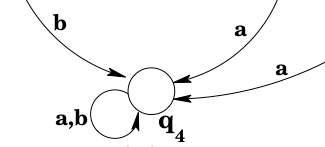
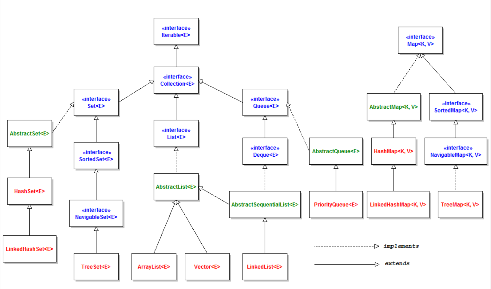
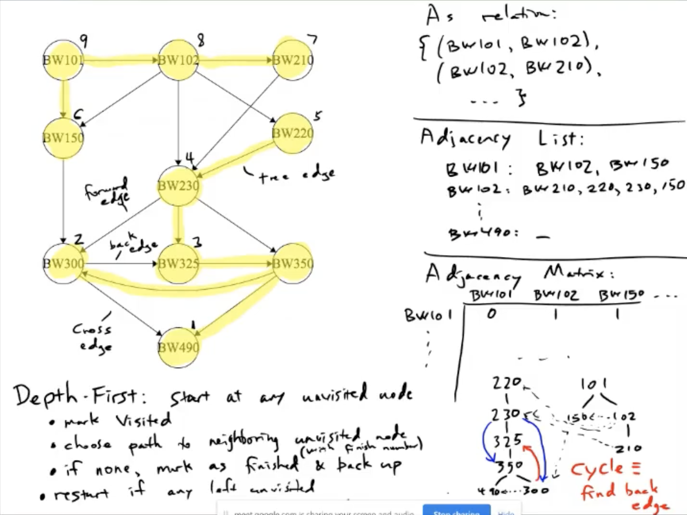
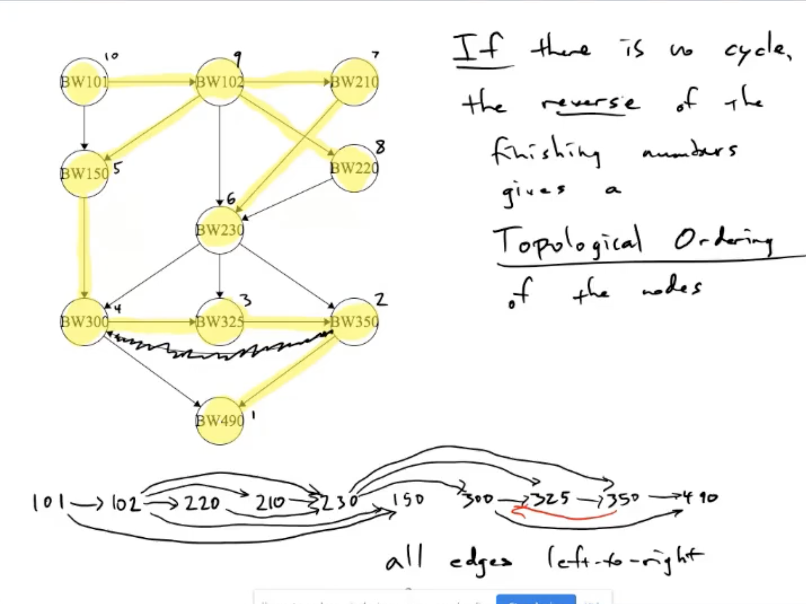
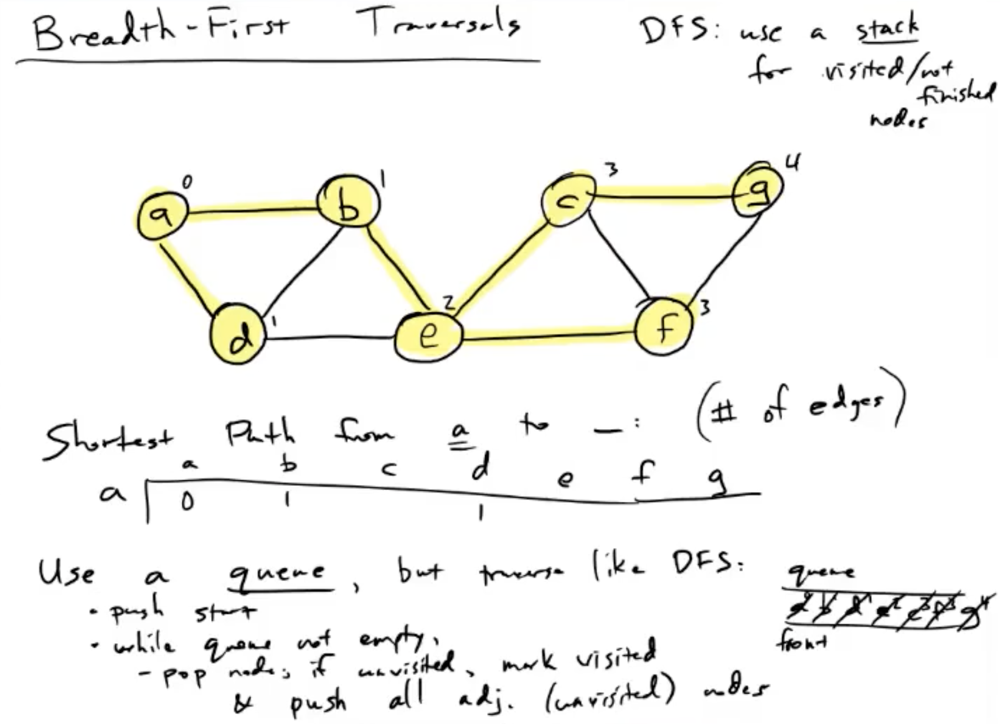
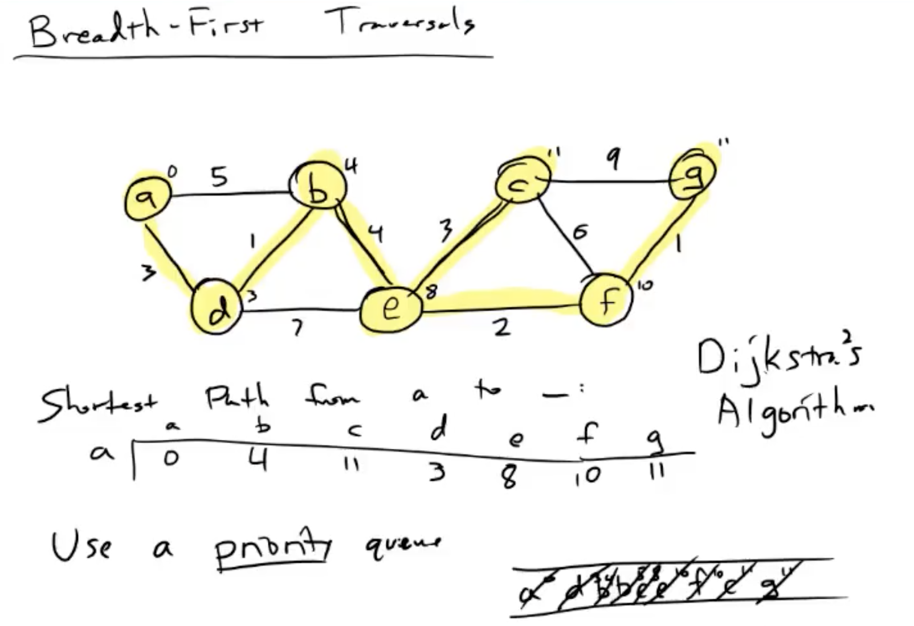
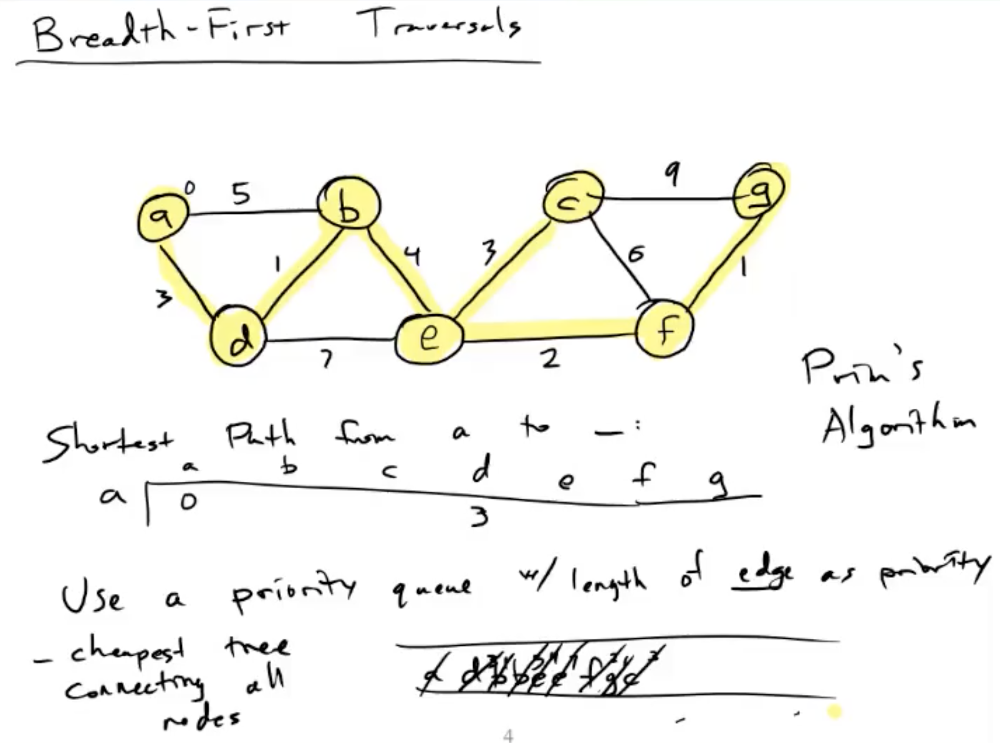

# StudyGuide

<br>

---

## Web Auth - Token

### Stateless server
- Stateless(Token) <-> Stateful(Session)
- Does NOT maintain STATE of client 
  - ONLY use calls from client 
  - Scalability: no connection between Server and Client

- Stateful Server
  - Maintain state of client side everytime get calls from client.
  - Ex) User Login -> store login data in session -> use the data for service
  - Session is stored in DB or server computer

### Suitable for Mobile App
Cookie is not a safe way for safe API

### Deliever auth information to other applications
- OAuth
  - Use facebook, Google accounts to login

### Security
- more secure

### Why use Token?

#### Server-based authentication (Session)
- Server store information of users
- 1. Flaws - Session
  - Too many users -> more sessions -> overload on server
- 2. Flaws - Scalability
  - Hard to expand server using session. 

#### Token-based authentication
- stateless: Does Not store user auth info on server
- Process
  1 User login with ID and PW
  2 Server check user info  
  3 If it is right, server assigns *signed* Token to the user
  4 Client stores Token and delievers Token whenever it requests server 
  5 Server authenticate Token and respond to the request

#### Advantage of Token
- Stateless & Scalability
  - If server stores sessions, when a user login, the user must request to the server that stores the user's session.
  - Which means, Hard to expand and use multiple servers
- Security
  - more secure than using cookie
- Extensibility
  - extend of login information, authorization
  - assign specific authority to specific users
- Diverse platforms and domains
  - for all platforms and domains, request is valied if Token is valid
- Web standard
  - JWT (JSON Web Token)

<br>

---

## Cookies
- store data of users (< 4KB)

```javascript
if (request.headers.cookie !== undefined) {
    let cookies = cookie.parse(request.headers.cookie);
    console.log(cookies);
  }
  response.writeHead(200, {
    'Set-Cookie': [
      'tasty_cookie=strawberry',
      `Permanent=cookies; Max-age=${60 * 60 * 24 * 30}`,
      'Secure=Secure; Secure',
      'HttpOnly=HttpOnly; HttpOnly',
      'Path=Path; Path=/cookie',
      'Domain=Domain; Domain=o2.org',
    ],
  });
```

further studies
- Session: to store ID, PW of users
- Personalize Website: Lang, Num of entrance
- hash, salt, key stretching: secure password (PBKDF2, bcrypt)

<br>

---


## Express
- Router: a way from the starting point to the destination
```javascript
app.get('/', (request, response) => {
    console.log('GET');
});
```

- Middleware   
    - esay understanding: Use of software that other people made. 
    - Modify request, response Object 

```javascript
app.use(bodyParser.urlencoded({ extended: false }));
```

```javascript
app.get('*', (request, response, next) => {
  fs.readdir('./data', function (error, filelist) {
    console.log('A');
    request.list = filelist;
    next();
  });
});
```
> -> Very similar to basic Routing!
> 
> -> In NodeJs, everything is Middleware 
>
> -> Little portions of software are connected together and used.


<br>

---
## MySQL 
- Structured Query Language
- relational database
> cd /usr/local/mysql/bin/
> ./mysql -uroot -p/../   WZ        `   

### Structure of MySQL
- table: information is stored in
- schema(database): grouped related tables
- database server: group of schemas


### Use of Schema
create & delete
> CREATE DATABASE mydata;
> DROP DATABASE mydata;

list of Database
> SHOW DATABASES;

select Database
> USE mydata;

### Create Table
```sql
CREATE TABLE  topic(
    --"col name" "data type(num to show)" "Cannot be NULL" "++" 
    id INT(11) NOT NULL AUTO_INCREMENT,
    title VARCHAR(100) NOT NULL,
    description TEXT NULL,
    created DATETIME NOT NULL,
    author VARCHAR(30) NULL,
    profile VARCHAR(100) NULL,
    PRIMARY KEY(id)
);
```

### CRUD
- Create, Read, Update, Delete

#### Create
```sql
INSERT INTO topic (title, description, created, author, profile) VALUES ('MySQL', 'MySQL is ...', NOW(), 'JunHong', 'Developer');
```

#### Read
```sql
SELECT * FROM topic;
```

Only selected columns
```sql
SELECT id,title,created,author FROM topic;
```

Only selected values
```sql
SELECT id,title,created,author FROM topic WHERE author='JunHong';
```

Ascending, Descending Order
```sql
SELECT id,title,created,author FROM topic WHERE author='JunHong' ORDER BY id DESC;
```

Get Limited number of data
```sql
SELECT id,title,created,author FROM topic WHERE author='JunHong' ORDER BY id DESC LIMIT 2;
```

#### Update
```sql
UPDATE topic SET description='Oracle is.....', title='Oracle' WHERE id=2;
```

#### Delete
```sql
DELETE FROM topic WHERE id=5;
```

### Join

> author table
>| id | name    | profile        |
>|--|--|--|
>|  1 | JunHong | Developer      |
>|  2 | seokjun | Admin          |
>|  3 | duru    | data scientist |

</br>

>topic table
>| id | title      | description       | created             | author_id |
>|--|--|--|--|--|
>|  1 | MySQL      | MySQL is ...      | 2020-12-28 17:22:29 |         1 |
>|  2 | Oracle     | Oracle is ...     | 2020-12-28 17:22:46 |         1 |
>|  3 | SQL Server | SQL is ...        | 2020-12-28 17:23:36 |         2 |
>|  4 | PostgreSQL | PostgreSQL is ... | 2020-12-28 17:23:59 |         3 |
>|  5 | MongoDB    | MongoDB is ...    | 2020-12-28 17:24:17 |         1 |


```sql
SELECT topic.id,title,description,created,name,profile FROM topic LEFT JOIN author ON topic.author_id = author.id;
```

> Result
>| id | title      | description       | created             | name    | profile        |
>|--|--|--|--|--|--|
>|  1 | MySQL      | MySQL is ...      | 2020-12-28 17:22:29 | JunHong | Developer      |
>|  2 | Oracle     | Oracle is ...     | 2020-12-28 17:22:46 | JunHong | Developer      |
>|  3 | SQL Server | SQL is ...        | 2020-12-28 17:23:36 | seokjun | Admin          |
>|  4 | PostgreSQL | PostgreSQL is ... | 2020-12-28 17:23:59 | duru    | data scientist |
>|  5 | MongoDB    | MongoDB is ...    | 2020-12-28 17:24:17 | JunHong | Developer      |

### Further studies
- index: faster
- modeling
- backup: mysqldump, binary log
- cloud: AWS RDS, Google Cloud SQL for MySQL, AZURE Database for MySQL

<br>

---


## Languages
- alphabet: finite, non-empty set.
- symbols: elements of the set.
- string: finite sequence of symbols from an alphabet

> Example: Σ = {0,1} is an alphabet, and 011, 1010, and 1 are all strings over Σ.

### String Operations
- length: ∣x∣
- concatenation: xy or x⋅y
    - associative: (xy)z = x(yz)
    - not commutaive: xy != yz
- reversal: x^R
 
### Empty String
- ε or λ
- ∣ε∣ = 0
- ε^R = ε
- ε⋅x = x⋅ε = x (for all string x)

### Σ*
- set of strings made up of zero or more symbols from Σ
- Σ : finite, Σ^* : infinite

> If Σ = {a,b}, then Σ^* = {ε,a,b,aa,ab,ba,bb,aaa,aab,…}.

### Definition of a language
language over an alphabet Σ

= subset of Σ^* 

= element of P(Σ^\*) = power set of Σ^\* 

### Kleene closure 
- two set of strings S and T: ST={st ∣ s ∈ S ∧ t ∈ T} 
- S<sup>2</sup> = set of all strings formed by concatenating two strings from S.
- Kleene closure S<sup>*</sup>: S<sup>0</sup> ∪ S<sup>1</sup> ∪ S<sup>2</sup> ∪…
- * operator: Kleene star operator

<br>

---

## Regular Expressions
- word = string = sequence of symbols from an alphabet
- formal language != human language (structural rules)
    - alphabet in FL == words in HL
    - words in FL == sentences in HL


- Regex: way of describing the grammatical structure of the strings
    - can be "mechanically" described or generated
    - computer can recognize strings


- L(r): language generated by a regular expression r


<br>

---
## Finite-State Automata
- input: finite string of symbols 
- Finite set of states
- Start state / Accepting / Final
- transition function: specifies what happens if the machine is in a particular state and looking at a particular input symbol

<br>

---

## DFA: Deterministic Finite-State Automata
- For every <current state, current input symbol> pair, there is exacly one possible nest state

> δ (transition function): δ<sup>*</sup>(q, w) == result state when in state q, input w
> δ<sup>*</sup>(q, ε) = q


- Accepting & Non-accepting states

Accepting
> Language L is accpeted by some machine M iff L = L(M) -> don't mean that L and maybe some other strings are accepted by M

Non-accepting 
>garbage, error, trap state



<br>

---
## NFA: Nondeterministic Finite-State Automata
- FSA with multiple input/ no input(ε-transition)? -> DFA does not work

> NFA: DFA + state-ε pair. (maps state input pair & stateε pair)
> ∂(q,a) = {q<sub>1</sub>, q<sub>2</sub>, ... ,q<sub>n</sub>} : might move to one of the states, original state q, input a.

- Accepting & Non-accepting states
> A string w is accepted by an NFA provided that at least one of the states in ∂ <sup>*</sup>(q, w) is an accepting state

<br>

---
## NFA and DFA
> NFA = super set of DFA. vice versa?
> 
> for any NFA, we can find DFA that accepts the same language.

For example

>NFA


>partially contructed DFA


<br>

---
## Finite-State Automata & Regular Languages

Regex to NFA
> [Every Regex can be recognized by NFA](https://bhoward.github.io/focsipedia/docs/lang/fsareg/) 

NFA to Regex
> Every language accepted by DFA / NFA is genereated by Regex. 

Properies of Regular Language
> - intersection of two regular languages is a regular language
> - union of two regular languages is a regular language
> - concatenation of two regular languages is a regular language
> - complement of a regular language is a regular language
> - Kleene closure of a regular language is a regular language


<br>

---
## Sequential Circuits
- Sequential logic circuits: circuits with cycles

- Synchronous: clock signal to synchronize the times when feedback is applied

- Asynchronous: feedback arrives as soon as gate delays permit. 

Gated D latch - SR latch with extra layer, D(data) E(enable) as input


flip-flop - clocked device, only respond to input for a very brief time

---


### Java Most Common Data Structures


<br>

---

### Numpy Vectorization #1
[Nuts and Bolts of NumPy Optimization Part 1: Understanding Vectorization and Broadcasting](https://blog.paperspace.com/numpy-optimization-vectorization-and-broadcasting/)

<br>

### mean, var, std
- [Blog: var: Why do we use n-1?, std](https://m.blog.naver.com/PostView.nhn?blogId=firerisk&logNo=221252800526&proxyReferer=https:%2F%2Fwww.google.com%2F)

- [Blog: var: Why do we use n-1?](https://jaehoo.tistory.com/entry/%ED%91%9C%EC%A4%80%ED%8E%B8%EC%B0%A8%EC%97%90%EC%84%9C-n-1-%EC%93%B0%EB%8A%94-%EC%9D%B4%EC%9C%A0)

<br>


---

### DFS
 
<br>




- No back edge = No Cycle
- DFS w/o cycle => Topological ordering
    - Graph into linear ordering 
    - repects "dependency"

<br>

---

<br>

### BFS

<br>



<br>

#### Dijkstra's Algorithm


>Google map : Shortest path from A to B

<br>

#### Prim's Algorithm


> - minimum spanning tree
>    - cost for connection each potential nodes in network<br>
>    - What's the cheapest way to get all computers connected?
